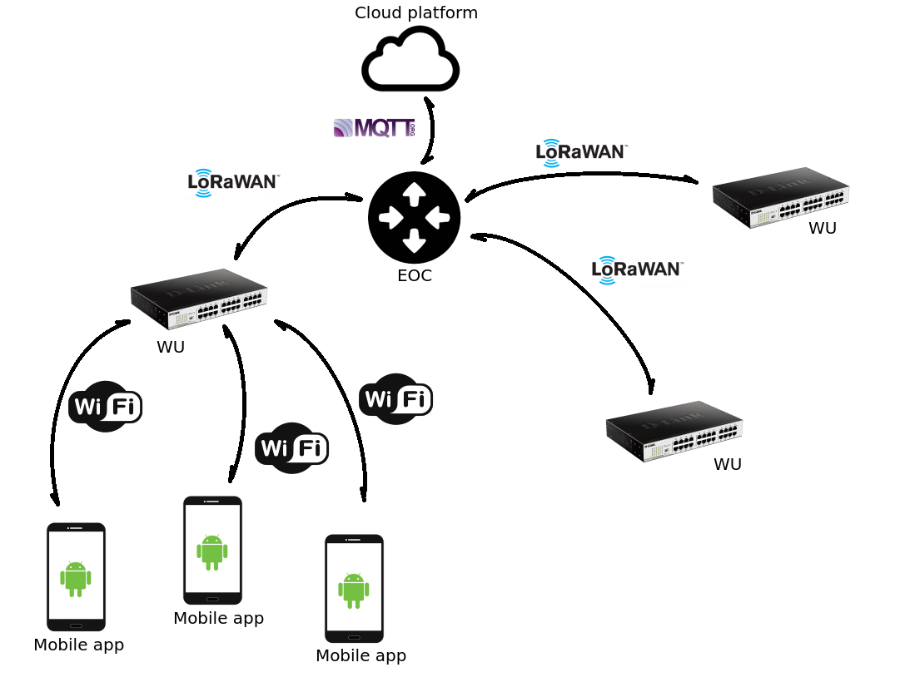
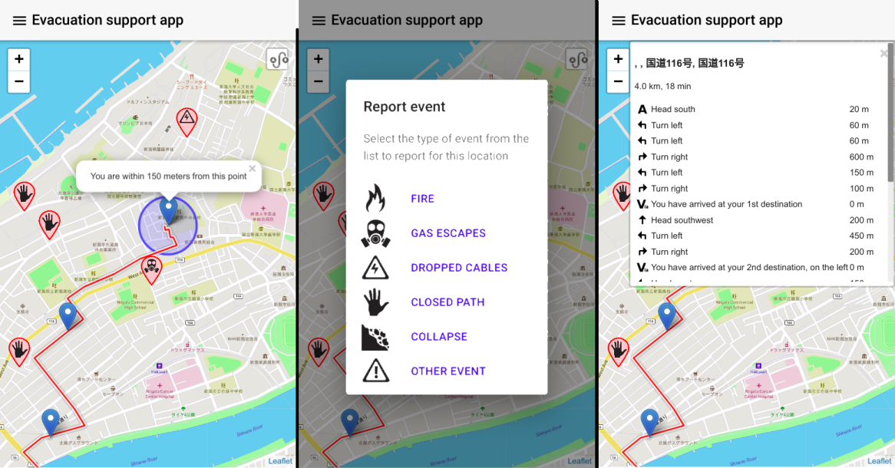

# Evacuation Supporting System based on IoT components

Original article:  
https://www.mdpi.com/2504-3900/31/1/38

An evacuation supporting system based on IoT-networked devices to guide people to safe places or shelters once the alert of an extreme event has been issued. The system is interactive and support crowd-sensing; this allows people to upload information on the state of the routes and the shelters, thus keep an updated status of the evacuation routes.

## General scheme

 

## WU

Based on a Raspberry Pi 3 Model B+ configured as access point with Kupiki hotspot (https://github.com/pihomeserver/Kupiki-Hotspot-Script) and the web application as captive portal.

## EOC

In progress...

## Web application

Libs:
  - jQuery: https://jquery.com/
  - Framework7: https://framework7.io/
  - Leaflet: https://leafletjs.com/
  - Leaflet-routing-machine: https://www.liedman.net/leaflet-routing-machine/
  - Leaflet-offline: https://github.com/robertomlsoares/leaflet-offline

Screenshots:
 